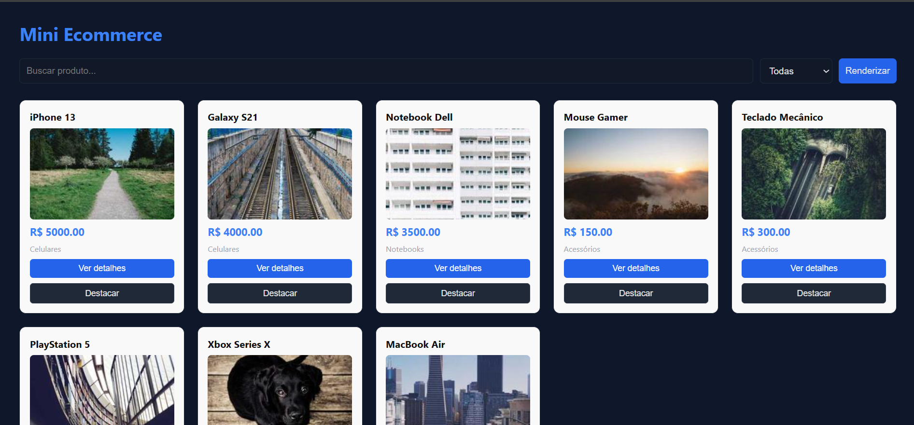
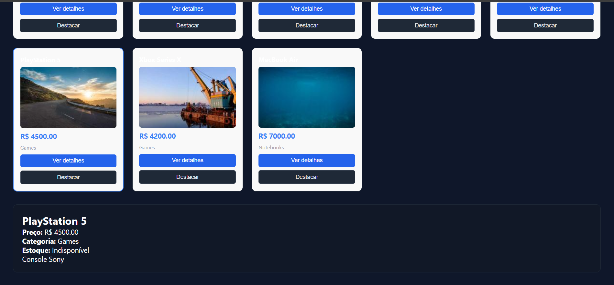
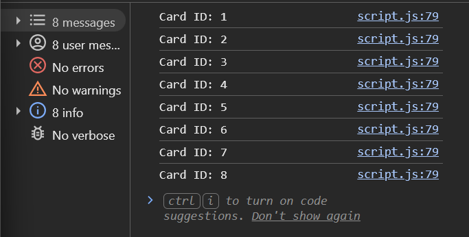

# 🛒 Mini Ecommerce – Catálogo em Cards

## 👤 Aluno
- Nome: José Venâncio
- Matrícula: 908181

---

## 📌 Descrição do Projeto

Este projeto consiste na criação de um mini eCommerce utilizando JavaScript puro, com foco em:

- Manipulação do DOM
- Uso de funções
- Renderização dinâmica de dados (JSON)
- Interação com o usuário (eventos)

Os produtos são exibidos em formato de **cards**, com funcionalidades de:

- 🔍 Busca por nome
- 📂 Filtro por categoria
- 📄 Visualização de detalhes
- ⭐ Destaque de produtos

---

## 🖥️ Funcionalidades

- Renderização dinâmica de produtos
- Filtro por texto e categoria
- Exibição de detalhes do produto
- Destaque visual nos cards
- Uso de eventos (click, input, change)

---

## 🧪 Tecnologias Utilizadas

- HTML
- CSS
- JavaScript

---

## 📸 Prints do Projeto

### 🛍️ Cards Renderizados

---

### 📄 Detalhes do Produto

---

### 🧾 Console (querySelectorAll)

---

## ⚙️ Observações Técnicas

Neste projeto foram utilizados:

- `getElementById`
- `querySelector`
- `querySelectorAll`
- `createElement`
- `appendChild`
- `innerHTML`
- `classList.add`
- `style`
- `addEventListener`